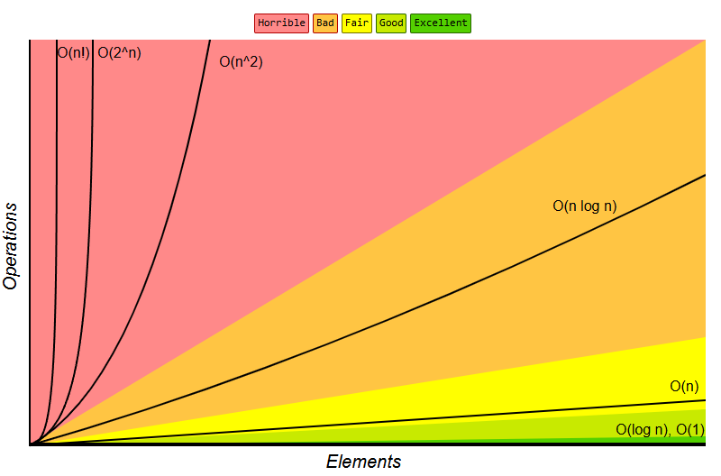

# Exemplos de Complexidade de Algoritmos (Big O Notation)

Este projeto contém exemplos práticos de funções JavaScript com diferentes complexidades de tempo, ilustrando a notação Big O. Cada arquivo representa um tipo de complexidade e mede o tempo de execução usando `console.time` e `console.timeEnd`.

## Como executar

Execute cada arquivo individualmente para ver o resultado e o tempo de execução:

Exemplo:
```bash
node linear.js
```

## Exemplos e Explicações



### 1. O(1) - Constante
Arquivo: `constant.js`

- **Função:** Retorna o primeiro elemento de um array.
- **Código:**
  ```js
  function getFirstElement(arr) {
    return arr[0];
  }
  console.time('constant');
  console.log('O(1) - getFirstElement([10, 20, 30]):', getFirstElement([10, 20, 30]));
  console.timeEnd('constant');
  ```
- **Explicação:** O tempo de execução não depende do tamanho do array.

---

### 2. O(log n) - Logarítmica
Arquivo: `logarithmic.js`

- **Função:** Busca binária em um array ordenado.
- **Código:**
  ```js
  function binarySearch(arr, target) {
    let left = 0;
    let right = arr.length - 1;
    while (left <= right) {
      const mid = Math.floor((left + right) / 2);
      if (arr[mid] === target) {
        return mid;
      } else if (arr[mid] < target) {
        left = mid + 1;
      } else {
        right = mid - 1;
      }
    }
    return -1;
  }
  console.time('logarithmic');
  console.log('O(log n) - binarySearch([1, 3, 5, 7, 9], 5):', binarySearch([1, 3, 5, 7, 9], 5));
  console.timeEnd('logarithmic');
  ```
- **Explicação:** O número de operações cresce logaritmicamente com o tamanho do array.

---

### 3. O(n) - Linear
Arquivo: `linear.js`

- **Função:** Soma todos os elementos de um array.
- **Código:**
  ```js
  function sumArray(arr) {
    let sum = 0;
    for (let i = 0; i < arr.length; i++) {
      sum += arr[i];
    }
    return sum;
  }
  console.time('linear');
  console.log('O(n) - sumArray([1, 2, 3, 4, 5]):', sumArray([1, 2, 3, 4, 5]));
  console.timeEnd('linear');
  ```
- **Explicação:** O tempo de execução cresce proporcionalmente ao tamanho do array.

---

### 4. O(n log n) - Linearítmica
Arquivo: `linearithmic.js`

- **Função:** Ordenação usando Merge Sort.
- **Código:**
  ```js
  function mergeSort(arr) {
    if (arr.length <= 1) return arr;
    const mid = Math.floor(arr.length / 2);
    const left = mergeSort(arr.slice(0, mid));
    const right = mergeSort(arr.slice(mid));
    return merge(left, right);
  }
  function merge(left, right) {
    let result = [];
    let i = 0;
    let j = 0;
    while (i < left.length && j < right.length) {
      if (left[i] < right[j]) {
        result.push(left[i++]);
      } else {
        result.push(right[j++]);
      }
    }
    return result.concat(left.slice(i)).concat(right.slice(j));
  }
  console.time('linearithmic');
  console.log('O(n log n) - mergeSort([3, 1, 4, 1, 5, 9, 2, 6, 5, 3, 5]):', mergeSort([3, 1, 4, 1, 5, 9, 2, 6, 5, 3, 5]));
  console.timeEnd('linearithmic');
  ```
- **Explicação:** Algoritmos de ordenação eficientes geralmente têm essa complexidade.

---

### 5. O(n^2) - Quadrática
Arquivo: `quadratic.js`

- **Função:** Verifica se há elementos duplicados em um array usando dois loops aninhados.
- **Código:**
  ```js
  function hasDuplicates(arr) {
    for (let i = 0; i < arr.length; i++) {
      for (let j = i + 1; j < arr.length; j++) {
        if (arr[i] === arr[j]) {
          return true;
        }
      }
    }
    return false;
  }
  console.time('quadratic');
  console.log('O(n^2) - hasDuplicates([1, 2, 3, 2]):', hasDuplicates([1, 2, 3, 2]));
  console.timeEnd('quadratic');
  ```
- **Explicação:** O tempo de execução cresce com o quadrado do tamanho do array.

---

### 6. O(2^n) - Exponencial
Arquivo: `exponential.js`

- **Função:** Calcula o n-ésimo número de Fibonacci de forma recursiva.
- **Código:**
  ```js
  function fibonacci(n) {
    if (n <= 1) return n;
    return fibonacci(n - 1) + fibonacci(n - 2);
  }
  console.time('exponential');
  console.log('O(2^n) - fibonacci(5):', fibonacci(5));
  console.timeEnd('exponential');
  ```
- **Explicação:** O número de operações dobra a cada incremento de n.

---

### 7. O(n!) - Fatorial
Arquivo: `factorial.js`

- **Função:** Gera todas as permutações possíveis de um array.
- **Código:**
  ```js
  function permute(arr) {
    if (arr.length <= 1) return [arr];
    let result = [];
    for (let i = 0; i < arr.length; i++) {
      const current = arr[i];
      const remaining = arr.slice(0, i).concat(arr.slice(i + 1));
      const perms = permute(remaining);
      for (let perm of perms) {
        result.push([current].concat(perm));
      }
    }
    return result;
  }
  console.time('factorial');
  console.log('O(n!) - permute([1, 2, 3]):', JSON.stringify(permute([1, 2, 3])));
  console.timeEnd('factorial');
  ```
- **Explicação:** O número de operações cresce fatorialmente com o tamanho do array.

---

## Sobre

Esses exemplos são didáticos e servem para ilustrar como diferentes algoritmos escalam em relação ao tamanho da entrada. Use-os para estudar, comparar e experimentar a notação Big O na prática! 